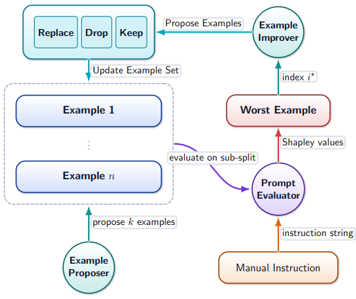

<div align="center">
  <h1>PIAST: Rapid Prompting with In-context Augmentation for Scarce Training Data</h1>

  Paweł Batorski, Paul Swoboda

  [](https://arxiv.org/abs/2512.11013)

</div>

<div align="center">
  
</div>

---

This repository contains the official implementation of the paper  
**[PIAST: Rapid Prompting with In-context Augmentation for Scarce Training Data](https://arxiv.org/abs/2512.11013)**

## Abstract

LLMs are highly sensitive to prompt design, but handcrafting effective prompts is difficult and often requires intricate crafting of few-shot examples. We propose a fast automatic prompt construction algorithm that augments human instructions by generating a small set of few shot examples. Our method iteratively replaces/drops/keeps few-shot examples using Monte Carlo Shapley estimation of example utility. For faster execution, we use aggressive subsampling and a replay buffer for faster evaluations. Our method can be run using different compute time budgets. On a limited budget, we outperform existing automatic prompting methods on text simplification and GSM8K and obtain second best results on classification and summarization. With an extended, but still modest compute budget we set a new state of the art among automatic prompting methods on classification, simplification and GSM8K. Our results show that carefully constructed examples, rather than exhaustive instruction search, are the dominant lever for fast and data efficient prompt engineering.

---

## ✨ Highlights

- ⚡ Fast automatic prompt construction that augments human instructions with a small set of few-shot examples
- 🎯 Uses Monte Carlo Shapley estimation to measure example utility and iteratively replace / drop / keep examples
- 🏎️ Speeds up evaluation via aggressive subsampling and a replay buffer
- ⏱️ Supports different compute time budgets (limited → extended) with strong results across tasks
---

## 🚀 Quickstart

### Limited Compute Budget

```bash
python gsm8k.py --run-grid-search --grid-k 16 --grid-infer-sizes 70 --grid-craft-iters 15 --grid-refine-cands 10 --grid-replay-add 5 --shapley-permutations 3 --eval-on-test --use-vllm-for-evaluator --grid-seed 1,2,3,4 --grid-results-csv results/gsm8k_final.csv
```

### Extended Compute Budget

```bash
python gsm8k.py --run-grid-search --grid-k 16 --grid-infer-sizes 70 --grid-craft-iters 150 --grid-refine-cands 10 --grid-replay-add 5 --shapley-permutations 3 --eval-on-test --use-vllm-for-evaluator --grid-seed 1,2,3,4 --grid-results-csv results/gsm8k_final.csv
```